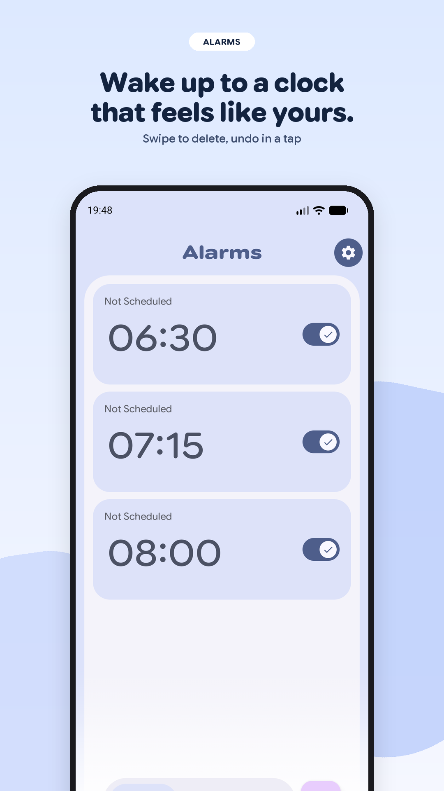
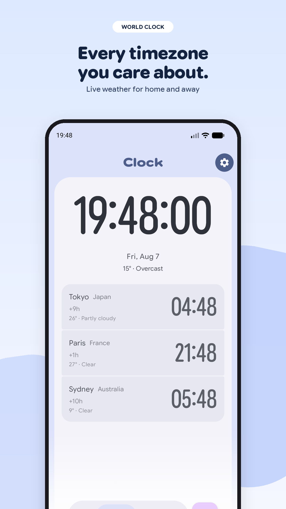
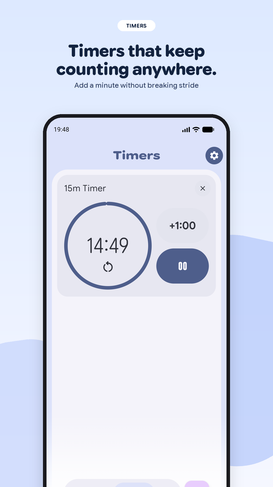
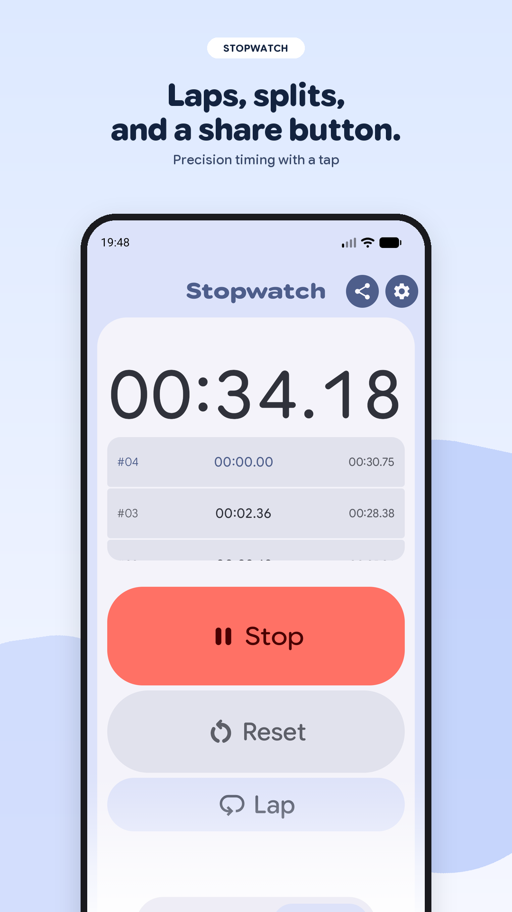
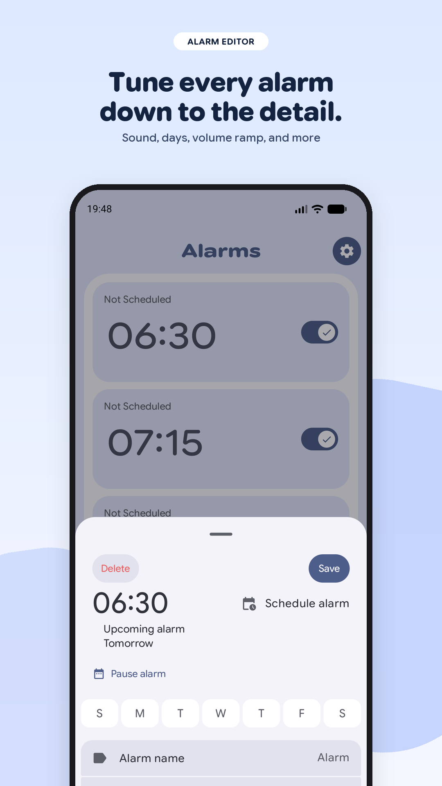
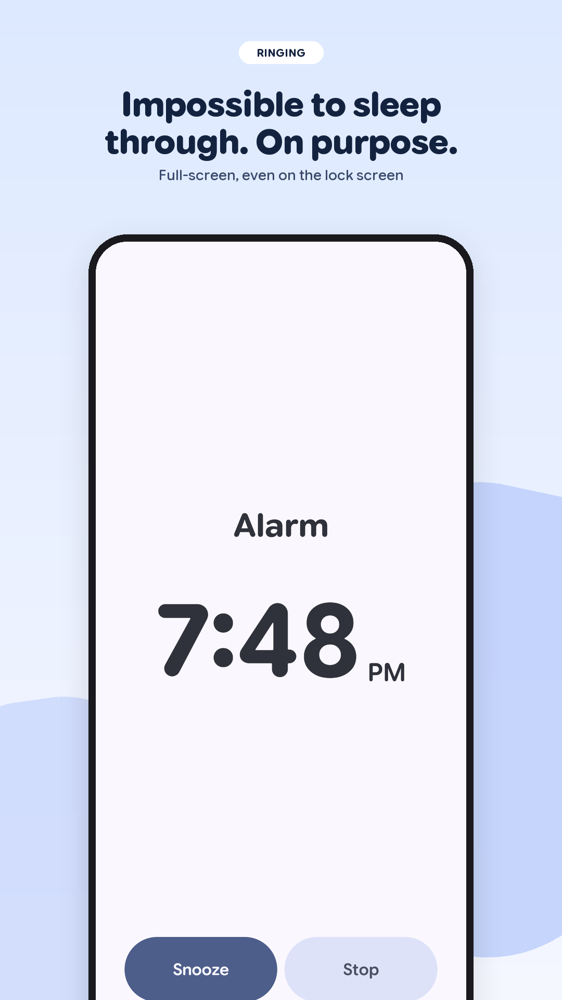
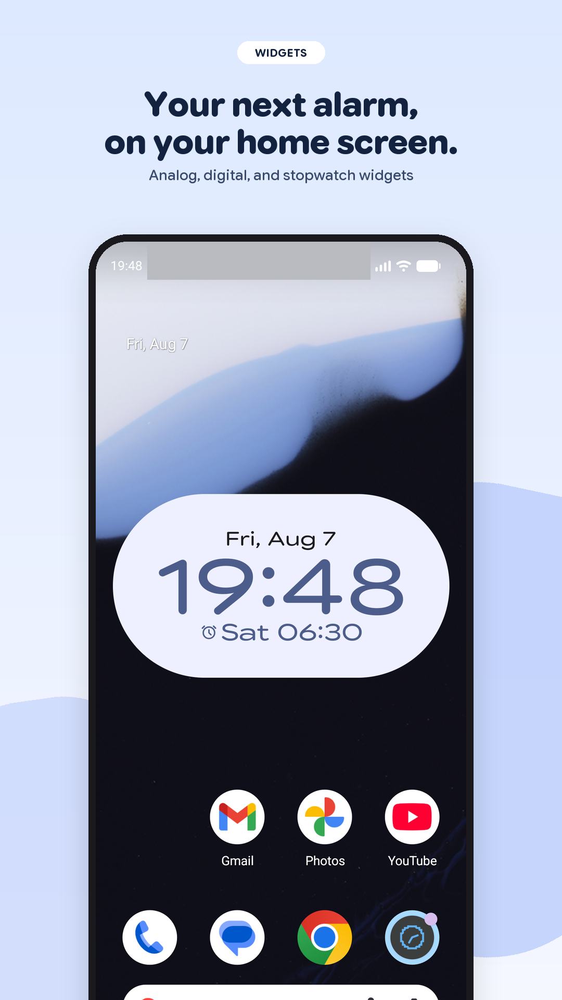
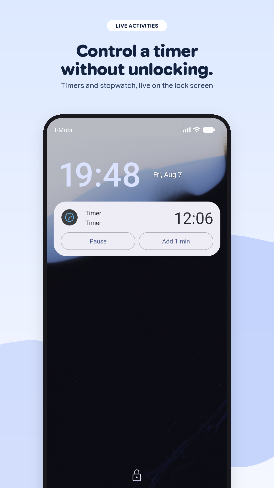
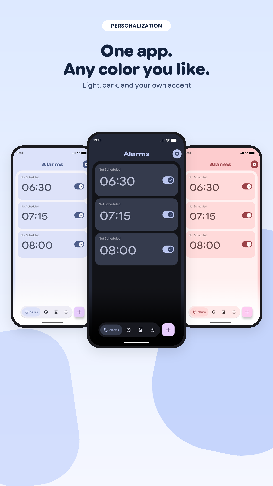

# Feldman Clock

A customizable, privacy-first clock for Android — alarms, timers, stopwatch, world clock,
home-screen widgets, and a standby mode — built with Jetpack Compose.

## Download

Grab the signed APK from the [latest release](https://github.com/feldmandev/feldman-clock/releases/latest).

Coming soon to Google Play.

You can also build it yourself; see [Source and builds](#source-and-builds).

## Features

- Alarms with custom sounds, per-alarm volume ramp, flip-or-shake to dismiss, and a flashlight pulse
- Dismissal challenges — solve a math problem, type a phrase, or shake the phone — set per alarm, and optionally required to snooze as well
- Swipe an alarm away with connected-card motion, and undo it from the snackbar
- Multiple concurrent timers and a stopwatch with laps, both live on the lock screen
- World clock with local time and weather for every city you add
- Home-screen widgets: analog clock, digital clock, stopwatch, and timer
- Quick Settings tiles for the timer, the stopwatch, and standby
- Standby mode that turns a charging device into a screensaver, and can host your existing widgets
- Full `AlarmClock` intent support, so assistants and other apps can set alarms and timers
- Back up alarms and settings to a file, and restore them on any device
- Dynamic color, light/dark/AMOLED themes, adjustable motion, and expressive card styling
- Localized into 90+ languages

No ads, no analytics, no accounts. See the [privacy policy](https://feldmandev.github.io/feldman-clock/privacy-policy.html).

### Companion apps

Feldman Clock exposes two signature-protected interfaces, so only apps signed with the same
key can use them. Both are on-device only — nothing travels over a network.

- **Feldman Launcher** — running and paused timers appear in At a Glance, and the clock widget is relayed live to the launcher so it stays in step to the second
- **Feldman Home** — browse, create, retime, enable and delete alarms, and edit the next alarm from a seamless sheet

## Screenshots

<p align="center">
  
  
  
  
</p>
<p align="center">
  
  
  
  
</p>
<p align="center">
  
</p>

## Requirements

- **Android 14 (API 34) or newer.** The app uses platform APIs introduced in API 34.
- Live activities on the lock screen require Android 16 (API 37).

## Source and builds

Requirements: **JDK 17** and the **Android SDK for API 37**.

Debug builds need no extra configuration:

```bash
./gradlew :app:assembleDebug
```

The debug variant installs as `com.feldman.clock.debug` and can sit alongside a release install.

### Release builds

Signing credentials are never stored in the repository. Copy the template and fill in your own:

```bash
cp keystore.properties.example keystore.properties
```

| Key | Meaning |
| --- | --- |
| `STORE_FILE` | Path to your `.jks` keystore |
| `STORE_PASSWORD` | Keystore password |
| `KEY_ALIAS` | Key alias inside the keystore |
| `KEY_PASSWORD` | Key password |

Each key can also be supplied as an environment variable of the same name, which is what CI
should do. Omit `STORE_FILE` entirely and the release build still runs, producing an
**unsigned** artifact — so contributors can build without any private material.

```bash
./gradlew :app:assembleRelease   # APK -> app/build/outputs/apk/release/
./gradlew :app:bundleRelease     # AAB -> app/build/outputs/bundle/release/
```

Release builds are minified with R8. Keep
`app/build/outputs/mapping/release/mapping.txt` for each release you publish, or crash
reports will be unreadable.

## Project layout

```
app/src/main/java/com/feldman/clock/
├── app/     Application, MainActivity, navigation, intent-API entry points,
│            Quick Settings tiles, companion-app providers
├── core/    Alarm scheduling and firing, data and persistence, ringtone playback,
│            network services, ContentProvider and backup
└── ui/      Compose screens: alarm, clock, timer, stopwatch, settings,
             onboarding, standby, widgets

alarm-ui/    Shared alarm-list UI and the bridge contract used by companion apps
```

Some classes under `core/` declare packages that don't match their directory (for example
`core/alarm/runtime/AlarmService.java` declares `package com.feldman.clock.alarm`). This is
deliberate: the manifest and every `PendingIntent` reference the flat package names, and
renaming them would break alarms scheduled by already-installed versions.

## Project policies

- [Privacy policy](PRIVACY.md)
- [Contributing](CONTRIBUTING.md)
- [Third-party notices](THIRD_PARTY_NOTICES.md)

## Attribution

Clock is a derivative work. In the spirit of GPL-3.0 §5, here is what it builds on and what
this fork changed.

**Upstream**

- [AOSP Desk Clock](https://android.googlesource.com/platform/packages/apps/DeskClock/) —
  Apache-2.0. The alarm, timer, and stopwatch data layer descends from it.
- [BlackyHawky/Clock](https://github.com/BlackyHawky/Clock) — GPL-3.0-only. The immediate
  parent of this fork; source of the feature set, the translations, and much of `core/`.
- App icon inspired by [LineageOS DeskClock](https://github.com/LineageOS/android_packages_apps_DeskClock),
  modified by [BlackyHawky](https://github.com/BlackyHawky).
- Translations contributed by the upstream community via
  [Weblate](https://translate.codeberg.org/projects/clock/).

**Changes in this fork**

- The entire UI was rewritten from Android Views/Fragments to Jetpack Compose.
- Added home-screen widgets (analog clock, digital clock, stopwatch, timer).
- Added a standby/dream mode that can host existing home-screen widgets.
- Added weather on the clock screen (Open-Meteo) and a network-backed city list.
- Added a multi-step onboarding flow for runtime permissions.
- Added per-alarm dismissal challenges and Quick Settings tiles.
- Added signature-protected providers for the companion Feldman apps.
- Re-organized `com.best.deskclock` into `com.feldman.clock` with a `core/` + `ui/` split.

This fork is **not** affiliated with or endorsed by BlackyHawky or the upstream project.
Please report issues with this fork here, not upstream.

## License

Clock is licensed under the **GNU General Public License v3.0** — see [LICENSE](LICENSE).

This is a strong copyleft license: any modification or larger work that uses Clock must also
be distributed under GPL-3.0 with complete corresponding source code.

Because Clock descends from AOSP Desk Clock, which is Apache-2.0, a copy of the Apache
License 2.0 is included as [LICENSE-Apache-2.0](LICENSE-Apache-2.0). Files carrying an
Apache-2.0 header remain available under those terms; the combined work is GPL-3.0.
